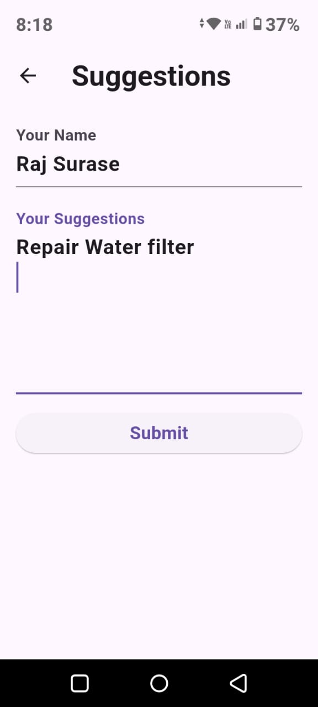

# Academic Management System

## Contact Details

[](mailto:your-email@example.com)
[](https://twitter.com/Raj-Surase)
[]([https://www.linkedin.com/in/raj-surase/])
[]([https://www.linkedin.com/in/raj-surase/])

<h2>Note: I created this project within 4 hours in the hackathon, so please consider it before reviewing this project.</h2>

## 1. Introduction

### Student Academic Management System

The Student Academic Management System is a robust platform I developed during a hackathon, earning a consolation prize for its innovative approach. This system empowers staff members with comprehensive tools to manage academic processes effectively. 

#### Key Features:
- **Real-time Tracking:** Track and manage academic performance in real-time.
- **Attendance Management:** Manage attendance records efficiently.
- **Detailed Reports:** Generate detailed reports on student progress.
- **User-Friendly Interface:** Easy-to-navigate interface for users.

## 2. Technology Stack

- Flutter
- Dart
- SQLite Database

## 3. APK File

[Download APK](https://drive.google.com/file/d/1N-nsev5j08xDLl1KSuETFrsNCxdtcouY/view?usp=sharing)

## 4. Screenshots




## 5. Steps to Install

```bash
1. Clone the repository:
   git clone https://github.com/Academic-Management-System.git

2. Navigate to the project directory:
   cd Academic-Management-System
   cd academia

3. Install dependencies:
   flutter pub get

4. Run the app:
   flutter run
```

## 6. Thank You

Thank you for reading the documentation. Please consider reviewing the project. Your contribution will mean a lot.
